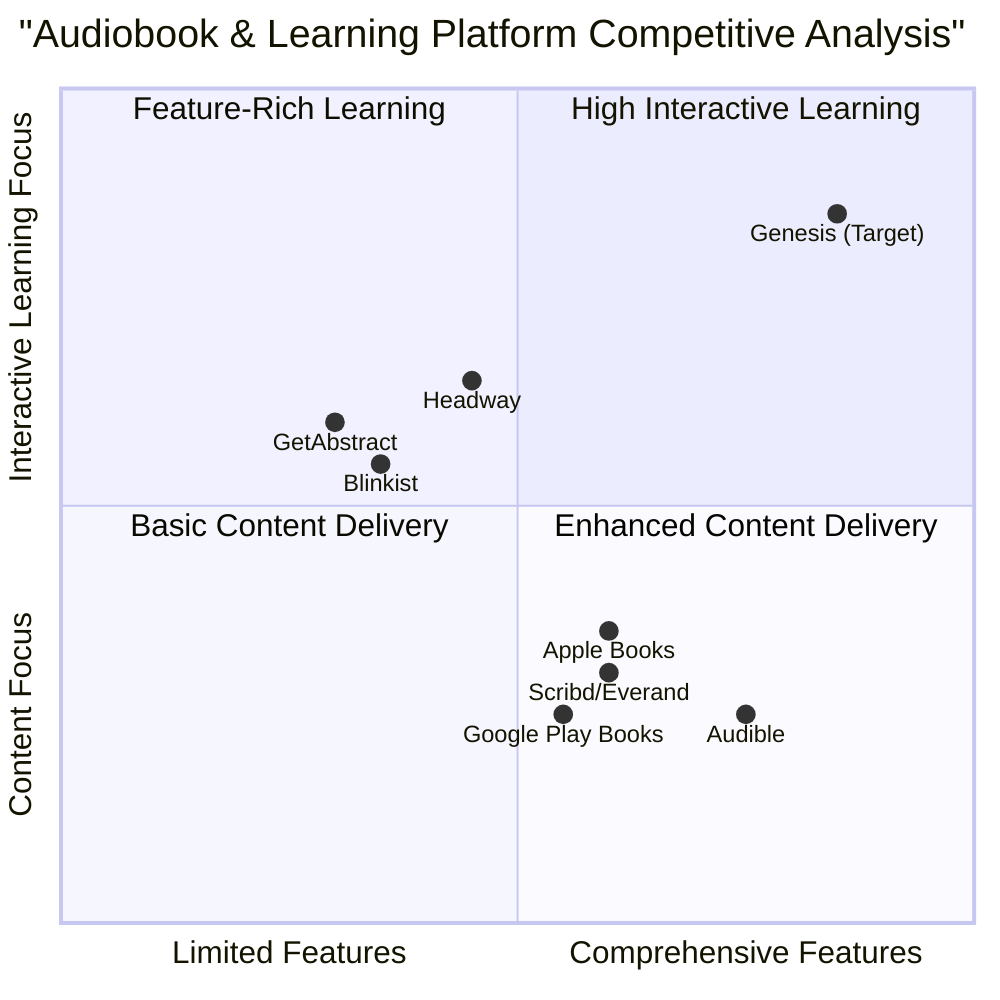

# Product Requirements Document: Genesis - The Interactive Knowledge Companion

## Table of Contents
1. [Executive Summary](#executive-summary)
2. [Market Analysis](#market-analysis)
   - [Market Overview](#market-overview)
   - [Market Size & Growth](#market-size--growth)
   - [Competitive Analysis](#competitive-analysis)
   - [Competitive Quadrant Chart](#competitive-quadrant-chart)
   - [Target Audience](#target-audience)
3. [Product Definition](#product-definition)
   - [Product Vision](#product-vision)
   - [Product Goals](#product-goals)
   - [User Stories](#user-stories)
4. [Feature Specifications](#feature-specifications)
   - [Dynamic Audiobook Generation](#dynamic-audiobook-generation)
   - [Personalized Learning & Comprehension Tools](#personalized-learning--comprehension-tools)
   - [Interactive Reading & Annotation](#interactive-reading--annotation)
   - [Contextual Research & Expansion](#contextual-research--expansion)
   - [Interactive Dialogue & Reflective Integration](#interactive-dialogue--reflective-integration)
5. [Technical Specifications](#technical-specifications)
   - [Requirements Analysis](#requirements-analysis)
   - [Requirements Pool](#requirements-pool)
   - [UI Design Draft](#ui-design-draft)
6. [Open Questions](#open-questions)
7. [Appendix](#appendix)
   - [Feature Enhancement Recommendations](#feature-enhancement-recommendations)

## Executive Summary

Genesis is an AI-powered platform designed to transform static digital books into interactive, personalized learning experiences. By leveraging advanced natural language processing, voice synthesis, and adaptive learning technologies, Genesis converts any digital book into an immersive audiobook with comprehensive learning tools, interactive features, and personalized content.

The platform addresses the growing demand for flexible, engaging learning experiences in a market where audiobook consumption is rapidly increasing (projected CAGR of 25-27% through 2030). Genesis differentiates itself by providing a complete ecosystem that transforms passive reading into active learning through AI-driven conversations, personalized quizzes, dynamic mind mapping, and contextual research expansion.

This document outlines the comprehensive requirements for the Genesis platform, including detailed market analysis, feature specifications, and technical requirements to guide development and ensure market fit.

## Market Analysis

### Market Overview

The convergence of audiobooks and educational technology represents a significant growth opportunity. Key market dynamics include:

- **Digital Transformation**: Audiobooks and e-learning are experiencing accelerated adoption due to changing consumer preferences for flexible, on-demand content consumption.

- **AI Integration**: Artificial intelligence is revolutionizing content creation, personalization, and interactivity in education and entertainment.

- **Mobile-First Consumption**: Smartphone adoption has driven audiobook usage, with 58% of users preferring mobile devices for content consumption.

- **Subscription Economy**: The shift from ownership to access-based models has transformed how users engage with digital content.

### Market Size & Growth

- **Audiobook Market**: Currently valued at $8.7-$10.88 billion in 2024, with projections to reach $13.30-$56.09 billion by 2030 (CAGR of 6.21% to 26.4%).

- **AI in Education**: Expected to reach $23.82 billion by 2023 with a CAGR of 38% through 2030.

- **Consumer Adoption**: 52% of US adults (approximately 149 million Americans) have listened to an audiobook, with 38% having listened in the past year (up from 35% in 2023).

- **Engagement Metrics**: Active audiobook listeners consume an average of 6.8 titles annually (up from 6.3 in 2022).

### Competitive Analysis

| Competitor | Strengths | Weaknesses | Key Differentiators |
|------------|-----------|------------|--------------------|
| **Audible** | - Largest library (200,000+ titles) - High-quality narration - Permanent ownership model - Strong ecosystem integration | - Limited interactive features - No learning tools - High subscription cost - No personalization | - Credit-based ownership model - Premium content exclusives - Audiobook market leader |
| **Blinkist** | - Concise book summaries - Focus on key concepts - Quick knowledge acquisition - Available in text/audio | - No full book experience - Limited to non-fiction - No personalized learning - No interaction with content | - 15-minute summary format - Business/self-improvement focus - Curation of essential insights |
| **Scribd/Everand** | - Subscription for unlimited access - Multi-format content (audiobooks, ebooks, magazines) - Affordable monthly cost | - No ownership of content - Limited selection vs. Audible - Minimal interactive features - No learning tools | - All-you-can-consume model - Content variety beyond books - Rental vs. ownership approach |
| **GetAbstract** | - Business-focused summaries - Professional development angle - Curated library for corporate use | - Limited to summaries - No full book engagement - No interactive features | - B2B focus - Enterprise learning solutions |
| **Headway** | - Gamified learning approach - Visual learning elements - Progress tracking | - Limited content library - No full book experience - Basic interactivity | - Gamification of learning - Visual knowledge acquisition |

The Genesis platform will differentiate itself by combining the comprehensive library approach of Audible with interactive learning features not present in any competitor. Unlike existing platforms that either focus solely on content delivery (Audible) or simplified knowledge acquisition (Blinkist), Genesis provides a complete ecosystem for transforming any book into a personalized learning experience.

### Competitive Quadrant Chart

### Target Audience

Genesis targets several distinct user segments with specific needs and preferences:

#### Primary Audience Segments

1. **Lifelong Learners (35%)**
   - **Demographics**: Adults 25-45, educated professionals
   - **Behaviors**: Regularly consume educational content, engage in self-improvement
   - **Needs**: Efficient knowledge acquisition, depth of understanding, ability to apply concepts
   - **Pain Points**: Time constraints, difficulty retaining information, challenges in applying theoretical concepts

2. **Students & Academics (25%)**
   - **Demographics**: High school and university students, educators, researchers
   - **Behaviors**: Study specific subjects, prepare for exams, conduct research
   - **Needs**: Comprehensive understanding of material, effective study methods, retention of information
   - **Pain Points**: Complex material comprehension, maintaining engagement, effective note-taking

3. **Busy Professionals (20%)**
   - **Demographics**: Working adults 30-55, mid to senior-level professionals
   - **Behaviors**: Multitask while consuming content, focus on practical knowledge
   - **Needs**: Time-efficient learning, practical applications, professional development
   - **Pain Points**: Limited time for reading, need for focused relevant content

4. **Recreational Readers (15%)**
   - **Demographics**: Various ages, primarily 18-65
   - **Behaviors**: Read for pleasure, explore diverse genres
   - **Needs**: Engaging content experiences, discovery of new books and topics
   - **Pain Points**: Maintaining engagement, discovering relevant content

5. **Accessibility Users (5%)**
   - **Demographics**: People with visual impairments, learning disabilities, or other accessibility needs
   - **Behaviors**: Rely on audio content, need adaptable interfaces
   - **Needs**: Full access to written content, customizable experience
   - **Pain Points**: Limited access to traditional books, inadequate accessibility features

#### User Behavior Patterns

- **58%** prefer mobile consumption on smartphones
- **37%** listen while commuting or traveling
- **42%** listen while exercising or doing household chores
- **63%** subscribe to at least one content platform
- **52%** are willing to pay premium prices for enhanced features
- **41%** prioritize personalized learning experiences
- **36%** engage with gamified educational content

The Genesis platform is designed to address the specific needs of each audience segment while delivering a unified experience that transforms static books into dynamic, personalized learning journeys.

## Product Definition

### Product Vision

Genesis transforms any digital book into a personalized mentor, a living repository of knowledge that adapts to individual learning styles and intellectual curiosity. Our platform empowers users to not just consume information, but to deeply understand, critically analyze, and integrate knowledge into their personal growth journey, continually expanding their intellectual horizons.

### Product Goals

1. **Transform Passive Reading into Active Learning**  
   Create an immersive ecosystem that converts static book content into dynamic, interactive experiences that promote deeper understanding and knowledge retention.

2. **Personalize the Learning Journey**  
   Develop adaptive technology that customizes the reading and learning experience based on individual preferences, learning styles, and knowledge gaps.

3. **Democratize Access to Knowledge**  
   Make complex information more accessible and engaging through AI-powered tools that adapt content to different learning needs and preferences.

### User Stories

#### Lifelong Learners

- **As a** lifelong learner with limited time,  
  **I want** to efficiently extract and retain key concepts from books,  
  **So that** I can continue learning while balancing other life responsibilities.

- **As a** curious individual exploring new subjects,  
  **I want** contextual explanations and expanded research on unfamiliar topics,  
  **So that** I can build comprehensive knowledge without constantly switching between resources.

#### Students & Academics

- **As a** university student preparing for exams,  
  **I want** interactive quizzes and mind maps based on my textbooks,  
  **So that** I can test my understanding and visualize complex relationships between concepts.

- **As a** researcher exploring academic literature,  
  **I want** to have meaningful dialogues about complex theories and findings,  
  **So that** I can deepen my comprehension and generate new insights.

#### Busy Professionals

- **As a** business executive with a packed schedule,  
  **I want** to listen to business books while commuting and seamlessly switch to reading with highlighted key points when at my desk,  
  **So that** I can maximize my learning efficiency across different contexts.

#### Accessibility Users

- **As a** person with dyslexia,  
  **I want** customizable audio narration with synchronized text highlighting,  
  **So that** I can better comprehend and engage with written content.

#### Recreational Readers

- **As a** fiction enthusiast,  
  **I want** an expressive narrative voice that adapts to different characters and emotions,  
  **So that** I can enjoy a more immersive storytelling experience.

## Feature Specifications

### Dynamic Audiobook Generation

#### Universal Book Ingestion

- **Must** support multiple digital book formats including PDF, ePub, Mobi, TXT, and DOCX
- **Must** preserve formatting, structure, tables, charts, and illustrations during content extraction
- **Must** provide error handling for corrupt or non-standard files with clear user feedback
- **Should** detect and properly handle special elements like footnotes, citations, and appendices
- **May** support OCR-based ingestion for scanned documents and images containing text

#### Context-Aware Voice Synthesis

- **Must** analyze book content to detect genre, tone, emotional cues, and narrative structure
- **Must** provide a selection of high-quality, diverse voices with different accents, ages, and styles
- **Must** generate voice narration that adapts tone and pacing to match content context (e.g., dialogue vs. description)
- **Should** appropriately handle character dialogue with voice differentiation in fiction
- **Should** allow users to customize voice parameters (pitch, speed, emphasis)
- **May** allow users to clone their own voice for personalized narration

#### Seamless Playback & Text Synchronization

- **Must** provide standard audiobook controls (play, pause, forward, rewind, speed control)
- **Must** synchronize audio with text highlighting during playback
- **Must** remember playback position across sessions and devices
- **Must** enable instant switching between reading and listening modes
- **Should** allow bookmarking and returning to specific positions
- **Should** provide configurable auto-scrolling of text during audio playback

### Personalized Learning & Comprehension Tools

#### Intelligent Quizzing & Assignments

- **Must** generate different quiz formats (multiple choice, true/false, short answer) based on book content
- **Must** adapt quiz difficulty based on user performance and learning pace
- **Must** provide immediate feedback with explanations for incorrect answers
- **Should** generate open-ended prompts and assignments for deeper engagement
- **Should** create summaries of key concepts before quizzing to reinforce learning
- **May** allow users to create and share custom quizzes

#### Socratic Method Engagement

- **Must** generate thought-provoking questions that explore deeper concepts from the text
- **Must** adapt questioning based on user responses to guide critical thinking
- **Must** provide hints and guidance when users struggle with complex concepts
- **Should** support both written and voice-based dialogue interaction
- **Should** recognize and adapt to different learning styles in question formulation

#### Dynamic Mind Mapping

- **Must** automatically create visual mind maps of key themes, characters, and concepts
- **Must** support user customization and expansion of auto-generated mind maps
- **Must** provide interactive navigation that connects mind map elements to relevant book sections
- **Should** allow zooming in/out to reveal different levels of detail and relationships
- **Should** enable export and sharing of created mind maps

#### Smart Flashcard Creation

- **Must** generate comprehensive flashcards from book content with key terms and definitions
- **Must** implement spaced repetition algorithms to optimize memorization
- **Must** include multi-modal content in flashcards (text, images, audio)
- **Should** allow users to edit, customize, and add their own flashcards
- **Should** track performance metrics on flashcard retention
- **May** generate video snippets or animations for complex concept flashcards

### Interactive Reading & Annotation

#### Multi-modal Annotation

- **Must** support text highlighting with color-coding and categorization
- **Must** enable text and audio note-taking linked to specific book sections
- **Must** transcribe voice notes to text automatically with high accuracy
- **Must** provide search functionality across all annotations
- **Should** allow annotation organization with tags and folders
- **Should** support drawing and sketching for visual annotations
- **May** enable collaborative annotations for group reading

### Contextual Research & Expansion

#### Intelligent Concept Tagging & Research

- **Must** allow users to tag concepts in the text for further exploration
- **Must** provide AI-generated research on tagged concepts from credible sources
- **Must** present synthesized information that expands on the book's content
- **Should** offer diverse research perspectives on controversial or complex topics
- **Should** cite all sources for expanded information
- **May** suggest related concepts based on user's research history

### Interactive Dialogue & Reflective Integration

#### Conversational AI for Book Exploration

- **Must** enable natural language conversation about any aspect of the book
- **Must** provide accurate, context-aware responses to questions about content
- **Must** support both factual queries and interpretive discussions
- **Should** maintain conversation history for continuous dialogue
- **Should** proactively suggest interesting discussion topics based on user interests
- **May** simulate conversations with book characters or authors

#### Personalized Journaling & Reflection

- **Must** provide templates for structured reflection on book content
- **Must** analyze journal entries to identify connections with book themes and concepts
- **Must** offer personalized insights that connect book content to user's expressed interests
- **Should** track development of thought and understanding over time
- **Should** suggest reflection topics based on reading progress

## Technical Specifications

### Requirements Analysis

The Genesis platform requires comprehensive technical infrastructure to support its innovative features. Key technical considerations include:

1. **Content Processing Architecture**
   - Document parsing and format conversion system for multiple file formats
   - Text extraction and structure preservation algorithms
   - Natural language processing for context and semantic understanding
   - Content segmentation for effective navigation and referencing

2. **AI and Machine Learning Systems**
   - Natural language understanding for conversational interaction
   - Voice synthesis and audio processing pipeline
   - Adaptive learning algorithms for personalization
   - Content analysis for quiz/flashcard/mind map generation
   - Contextual research aggregation and synthesis capabilities

3. **User Experience & Interface**
   - Intuitive multi-modal interaction (text, voice, touch)
   - Seamless transitions between reading and listening modes
   - Responsive design for diverse devices and screen sizes
   - Accessibility compliance with WCAG guidelines

4. **Data Management & Security**
   - Secure user data storage and processing
   - Content rights management and DRM implementation
   - Progress tracking and analytics storage
   - Cloud-based synchronization across devices

### Requirements Pool

| ID | Requirement | Priority | Notes |
|----|-------------|----------|-------|
| **Content Processing** |||||
| CP-01 | Multi-format document parser | P0 | Core functionality |
| CP-02 | Structure preservation algorithm | P0 | Essential for maintaining book integrity |
| CP-03 | Metadata extraction | P1 | For content categorization |
| CP-04 | OCR capability | P2 | For scanned documents |
| **AI Systems** |||||
| AI-01 | Context-aware text analysis | P0 | Foundation for all AI features |
| AI-02 | High-quality voice synthesis | P0 | Core audiobook functionality |
| AI-03 | Adaptive learning algorithm | P0 | Essential for personalization |
| AI-04 | Natural language conversation | P0 | Core for interactive dialogue |
| AI-05 | Content summarization | P1 | For quiz and mind map generation |
| AI-06 | Research aggregation system | P1 | For contextual expansion |
| **User Interface** |||||
| UI-01 | Unified reader/player interface | P0 | Core user experience |
| UI-02 | Annotation system | P0 | Essential interactive feature |
| UI-03 | Mind map visualization | P1 | Key for knowledge organization |
| UI-04 | Quiz/flashcard interface | P1 | Learning reinforcement |
| UI-05 | Settings and preferences | P1 | Personalization |
| **Data & Infrastructure** |||||
| DI-01 | User account management | P0 | Core functionality |
| DI-02 | Content library management | P0 | Essential for organization |
| DI-03 | Progress tracking database | P1 | For learning analytics |
| DI-04 | Cross-device synchronization | P1 | Important for seamless experience |
| DI-05 | Offline content access | P1 | For mobile use |
| **Security & Compliance** |||||
| SC-01 | User data encryption | P0 | Privacy protection |
| SC-02 | Content DRM | P0 | Copyright protection |
| SC-03 | GDPR compliance | P0 | Legal requirement |
| SC-04 | Accessibility compliance | P0 | Inclusive design requirement |

### UI Design Draft

The Genesis platform will feature a clean, intuitive interface with these key elements:

1. **Main Dashboard**
   - Personal library with cover thumbnails and progress indicators
   - Recently accessed books and suggested content
   - Learning stats and achievements visualization
   - Quick access to tools and features

2. **Reader/Player Interface**
   - Dual-mode view with synchronized text and audio
   - Minimalist controls that appear when needed
   - Annotation tools in side panel
   - Chapter/section navigation

3. **Learning Center**
   - Hub for all interactive learning tools
   - Quiz/flashcard interface
   - Mind map visualization
   - Conversation/dialogue interface
   - Research and expansion panel

4. **Mobile Experience**
   - Optimized for on-the-go listening
   - Gesture-based controls
   - Audio-first interaction with voice commands
   - Compact learning tools

## Open Questions

1. **Rights Management**: How will the platform handle copyright and licensing for book content conversion? Will we need to establish partnerships with publishers?

2. **AI Voice Quality**: What is the acceptable threshold for voice synthesis quality before public release? How will we measure this?

3. **Personalization Depth**: How comprehensive should the learning style assessment be at launch? What minimum dataset is required for effective personalization?

4. **Performance Optimization**: What are the minimum device specifications required to run the platform effectively?

5. **Data Privacy**: What specific user data needs to be collected to power personalization features, and how will this be communicated to users?

## Additional Features

### Community & Social Learning Features

#### Book Clubs & Discussion Groups

- **Must** enable users to create and join virtual book clubs around specific titles or genres
- **Must** provide discussion boards and threads linked to specific book sections
- **Must** support scheduled virtual meetups with audio/video capabilities
- **Should** offer facilitation tools like discussion prompts and moderation features
- **Should** integrate with calendar apps for meeting reminders
- **May** provide AI-generated discussion guides and questions

#### Knowledge Sharing

- **Must** allow users to share annotations, mind maps, and notes with specific individuals or groups
- **Must** implement permissions settings for shared content
- **Must** support export of user-generated content in multiple formats
- **Should** provide a discovery system for finding valuable shared content from other users
- **Should** enable rating and commenting on shared resources
- **May** implement reputation/contribution system to highlight valuable community members

#### Expert Connections

- **Must** facilitate partnerships with authors, educators, and subject matter experts
- **Must** support scheduled live Q&A sessions with verified experts
- **Must** provide tools for experts to create supplementary content for specific books
- **Should** implement verification system for expert credentials
- **Should** enable revenue sharing for expert contributions
- **May** include AI-moderated discussions between users and simulated expert perspectives

### Enhanced Personalization

#### Learning Style Adaptation

- **Must** provide initial assessment of user's learning preferences (visual, auditory, reading/writing, kinesthetic)
- **Must** adapt content presentation based on identified learning styles
- **Must** continuously refine learning style profile based on user behavior and feedback
- **Should** explain personalization choices to users for transparency
- **Should** allow manual override of automated style adaptations
- **May** incorporate psychological research on optimal learning methods

#### Progress Analytics Dashboard

- **Must** track reading progress, quiz performance, and engagement metrics
- **Must** visualize learning trends and patterns over time
- **Must** provide actionable insights based on performance data
- **Should** allow customization of tracked metrics and dashboard layout
- **Should** implement goal-setting features with progress tracking
- **May** compare anonymized performance against relevant peer groups

#### Personalized Learning Path

- **Must** suggest books and content based on user interests and knowledge gaps
- **Must** create sequential learning journeys across multiple related books
- **Must** adapt recommendations based on user feedback and performance
- **Should** identify prerequisite knowledge and suggest remedial content when needed
- **Should** provide clear rationale for suggested learning paths
- **May** integrate with professional development frameworks or academic curricula

### Extended Content Features

#### Multi-language Support

- **Must** provide real-time translation of book content into major languages
- **Must** support voice synthesis in multiple languages with appropriate accents
- **Must** preserve formatting and structure during translation
- **Should** allow side-by-side viewing of original and translated text
- **Should** maintain context-appropriate translations of idioms and cultural references
- **May** offer language learning features that leverage dual-language display

#### Content Summarization Layers

- **Must** generate summaries of varying detail levels (brief overview, chapter summaries, detailed explanations)
- **Must** allow users to toggle between summary levels based on time constraints
- **Must** ensure summaries accurately reflect key points and narrative flow
- **Should** integrate summaries with the full text for seamless navigation
- **Should** generate visual summary formats like timelines and concept maps
- **May** provide executive summaries focused on actionable insights

#### Audio Speed & Complexity Controls

- **Must** provide standard playback speed adjustments without pitch distortion
- **Must** offer language complexity adjustments for different comprehension levels
- **Must** include vocabulary simplification options while preserving meaning
- **Should** adapt speech patterns for clarity at higher playback speeds
- **Should** provide inline definitions for complex terminology
- **May** adjust content complexity dynamically based on user engagement signals

### Accessibility and Convenience

#### Offline Mode

- **Must** allow downloading of books and generated audio for offline access
- **Must** enable basic interactive features without internet connection
- **Must** synchronize offline activity when connection is restored
- **Should** optimize storage use with configurable download quality options
- **Should** provide clear indication of which content is available offline
- **May** implement progressive functionality based on connection quality

#### Cross-device Synchronization

- **Must** seamlessly sync content, progress, and annotations across all user devices
- **Must** support instant transition between devices mid-session
- **Must** implement conflict resolution for simultaneous edits
- **Should** optimize synchronization for bandwidth efficiency
- **Should** provide device-specific interface optimizations while maintaining consistent experience
- **May** support temporary device authorization for travel or one-time use

#### Enhanced Accessibility Features

- **Must** comply with WCAG 2.1 AA standards for accessibility
- **Must** support screen readers and other assistive technologies
- **Must** include dyslexia-friendly fonts and color contrast settings
- **Should** provide alternative navigation methods for motor impairments
- **Should** implement customizable UI element sizing and spacing
- **May** incorporate eye-tracking navigation for severely impaired users

### Enhanced AI Capabilities

#### Character Immersion

- **Must** enable conversations with simulated book characters
- **Must** ensure character responses are consistent with their portrayal in the book
- **Must** provide insights into character motivations, backgrounds, and perspectives
- **Should** adapt character dialogue to user's preferred communication style
- **Should** enable exploration of alternative character choices and outcomes
- **May** allow users to "interview" characters about key events and decisions

#### Scenario Simulations

- **Must** create interactive scenarios based on book concepts and principles
- **Must** allow users to apply book knowledge to simulated real-world situations
- **Must** provide feedback on decisions and alternative approaches
- **Should** adapt scenarios to user's professional context or interests
- **Should** present multiple difficulty levels for progressive skill building
- **May** incorporate gamification elements like points and achievements

#### Visual Learning Integration

- **Must** generate relevant visual aids for complex concepts
- **Must** create diagrams and illustrations that complement textual explanations
- **Must** implement interactive visualizations of abstract ideas
- **Should** convert numerical data from text into charts and graphs
- **Should** provide animated explanations of processes and sequences
- **May** generate 3D models for scientific or technical concepts

### Business & Monetization Features

#### Tiered Subscription Model

- **Must** offer different service tiers from basic to premium
- **Must** clearly differentiate features available at each subscription level
- **Must** implement seamless upgrade/downgrade pathways
- **Should** provide institutional and family subscription options
- **Should** offer limited free trial of premium features
- **May** implement pay-per-use options for specific premium features

#### Creator Platform

- **Must** enable educators and content creators to build custom learning experiences
- **Must** provide tools for creating guided learning journeys using book content
- **Must** support revenue sharing for creator-generated content
- **Should** implement discovery system for finding relevant creator content
- **Should** offer analytics for creators to track engagement with their materials
- **May** facilitate collaboration between multiple creators

#### Enterprise Solutions

- **Must** provide organization-wide deployment options with centralized management
- **Must** support integration with learning management systems
- **Must** offer custom branding and white-label options
- **Should** include ROI measurement tools for corporate training
- **Should** provide department-specific usage analytics
- **May** offer custom content creation services for enterprise clients

## AI-Driven Language Learning Exploration

### Market Opportunity Assessment

The global language learning market represents a significant opportunity, valued at approximately $61.8 billion in 2023 and projected to reach $185.3 billion by 2032, growing at a CAGR of 12.9%. Integrating language learning functionality into the Genesis platform could create substantial additional value by addressing several key market trends:

1. **Increasing demand for self-paced, personalized learning experiences**
2. **Growth in mobile-first language learning approaches**
3. **Rising preference for immersive, context-based language acquisition**
4. **Expanding market for business-oriented language learning solutions**

The unique advantage of integrating language learning into Genesis lies in leveraging existing content as authentic learning material, creating a more engaging and contextually rich language learning environment compared to standalone language apps.

### Proposed Functionality

#### Interactive Grammar & Syntax

- Real-time grammatical structure analysis of book content
- Interactive exercises generated from book text to practice identified grammar principles
- Progression system that introduces increasingly complex grammatical structures
- Comparative analysis between user's native language and target language grammar

#### Pronunciation Training

- AI-powered speech recognition to evaluate user pronunciation
- Phonetic breakdown of challenging words and phrases
- Customized practice exercises focusing on specific phonemes and sound patterns
- Rhythm and intonation training for natural-sounding speech

#### Vocabulary Building

- Intelligent identification of new vocabulary from book content
- Personalized spaced repetition system for vocabulary retention
- Context-based learning that shows multiple usage examples
- Visual association techniques for improved memorization

#### Immersive Conversations

- Role-playing scenarios based on book dialogues
- Adaptive conversation partners that adjust language complexity to user level
- Real-time feedback on grammar, vocabulary, and pronunciation during conversations
- Cultural context explanations for idiomatic expressions

### Technical Feasibility

Implementing language learning functionality would require additional technical components:

1. **Speech recognition engine** optimized for non-native speakers
2. **Grammatical analysis system** capable of processing multiple languages
3. **Pronunciation evaluation algorithms** with phonetic comparison capabilities
4. **Expanded NLP capabilities** for generating appropriate language exercises

These components would build upon the core AI systems already required for Genesis, representing an estimated 30-40% increase in AI development complexity.

### Implementation Recommendation

**Recommendation: Phased Implementation**

While the language learning functionality presents a compelling opportunity, including it in the initial scope would significantly increase development complexity and time-to-market. We recommend a phased approach:

**Phase 1 (Initial Launch):**
- Implement basic multi-language support for book content
- Include foundational components that will support future language learning features
- Conduct market validation with target users

**Phase 2 (First Major Update, 4-6 months post-launch):**
- Introduce vocabulary building tools integrated with book content
- Add basic pronunciation training for highlighted text
- Implement simple grammar explanations

**Phase 3 (Second Major Update, 9-12 months post-launch):**
- Launch full interactive conversation capabilities
- Implement comprehensive grammar training system
- Add advanced pronunciation coaching with personalized exercises

This phased approach allows for market validation while building toward a comprehensive language learning solution that differentiates Genesis from both traditional audiobook platforms and standalone language learning applications.

## Appendix

### Feature Enhancement Recommendations

Based on market research and competitive analysis, the following additional features could further enhance the Genesis platform in future iterations:

1. **Virtual Reading Groups**: AI-facilitated book discussion groups that match users with similar interests and reading goals.

2. **Author Insights Integration**: Partnership opportunities with publishers to include exclusive author commentary and insights.

3. **Neuroplasticity-Based Learning**: Incorporate latest cognitive science research to optimize information retention and understanding.

4. **Augmented Reality Integration**: Enable physical book scanning to overlay digital features on printed books.

5. **Writing Assistance**: Help users develop their own writing skills based on stylistic analysis of books they've enjoyed.

6. **Publication Pathway**: Enable users to create and publish their own interactive books on the platform.

7. **Brain-Computer Interface Compatibility**: Future-proofing for emerging technologies that could enable more intuitive interaction.

8. **Physical-Digital Hybrid Experience**: Integrate with smart home systems for immersive reading environments (lighting, sound, etc.).

9. **Health & Wellbeing Integration**: Connect reading habits with mindfulness, sleep, and other wellbeing applications.
