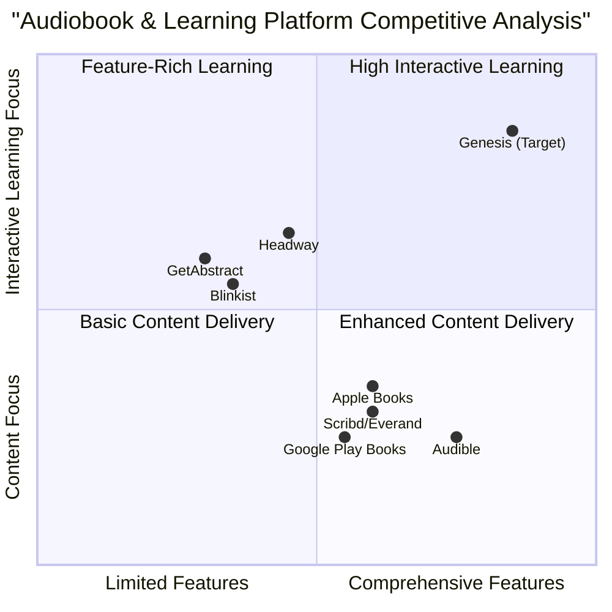

# Product Requirements Document: Genesis - The Interactive Knowledge Companion

## Table of Contents
1. [Executive Summary](#executive-summary)
2. [Market Analysis](#market-analysis)
   - [Market Overview](#market-overview)
   - [Market Size & Growth](#market-size--growth)
   - [Competitive Analysis](#competitive-analysis)
   - [Competitive Quadrant Chart](#competitive-quadrant-chart)
   - [Target Audience](#target-audience)
3. [Product Definition](#product-definition)
   - [Product Vision](#product-vision)
   - [Product Goals](#product-goals)
   - [User Stories](#user-stories)
4. [Feature Specifications](#feature-specifications)
   - [Dynamic Audiobook Generation](#dynamic-audiobook-generation)
   - [Personalized Learning & Comprehension Tools](#personalized-learning--comprehension-tools)
   - [Interactive Reading & Annotation](#interactive-reading--annotation)
   - [Contextual Research & Expansion](#contextual-research--expansion)
   - [Interactive Dialogue & Reflective Integration](#interactive-dialogue--reflective-integration)
5. [Technical Specifications](#technical-specifications)
   - [Requirements Analysis](#requirements-analysis)
   - [Requirements Pool](#requirements-pool)
   - [UI Design Draft](#ui-design-draft)
6. [Open Questions](#open-questions)
7. [Appendix](#appendix)
   - [Feature Enhancement Recommendations](#feature-enhancement-recommendations)

## Executive Summary

Genesis is an AI-powered platform designed to transform static digital books into interactive, personalized learning experiences. By leveraging advanced natural language processing, voice synthesis, and adaptive learning technologies, Genesis converts any digital book into an immersive audiobook with comprehensive learning tools, interactive features, and personalized content.

The platform addresses the growing demand for flexible, engaging learning experiences in a market where audiobook consumption is rapidly increasing (projected CAGR of 25-27% through 2030). Genesis differentiates itself by providing a complete ecosystem that transforms passive reading into active learning through AI-driven conversations, personalized quizzes, dynamic mind mapping, and contextual research expansion.

This document outlines the comprehensive requirements for the Genesis platform, including detailed market analysis, feature specifications, and technical requirements to guide development and ensure market fit.

## Market Analysis

### Market Overview

The convergence of audiobooks and educational technology represents a significant growth opportunity. Key market dynamics include:

- **Digital Transformation**: Audiobooks and e-learning are experiencing accelerated adoption due to changing consumer preferences for flexible, on-demand content consumption.

- **AI Integration**: Artificial intelligence is revolutionizing content creation, personalization, and interactivity in education and entertainment.

- **Mobile-First Consumption**: Smartphone adoption has driven audiobook usage, with 58% of users preferring mobile devices for content consumption.

- **Subscription Economy**: The shift from ownership to access-based models has transformed how users engage with digital content.

### Market Size & Growth

- **Audiobook Market**: Currently valued at $8.7-$10.88 billion in 2024, with projections to reach $13.30-$56.09 billion by 2030 (CAGR of 6.21% to 26.4%).

- **AI in Education**: Expected to reach $23.82 billion by 2023 with a CAGR of 38% through 2030.

- **Consumer Adoption**: 52% of US adults (approximately 149 million Americans) have listened to an audiobook, with 38% having listened in the past year (up from 35% in 2023).

- **Engagement Metrics**: Active audiobook listeners consume an average of 6.8 titles annually (up from 6.3 in 2022).

### Competitive Analysis

| Competitor | Strengths | Weaknesses | Key Differentiators |
|------------|-----------|------------|--------------------|
| **Audible** | - Largest library (200,000+ titles) - High-quality narration - Permanent ownership model - Strong ecosystem integration | - Limited interactive features - No learning tools - High subscription cost - No personalization | - Credit-based ownership model - Premium content exclusives - Audiobook market leader |
| **Blinkist** | - Concise book summaries - Focus on key concepts - Quick knowledge acquisition - Available in text/audio | - No full book experience - Limited to non-fiction - No personalized learning - No interaction with content | - 15-minute summary format - Business/self-improvement focus - Curation of essential insights |
| **Scribd/Everand** | - Subscription for unlimited access - Multi-format content (audiobooks, ebooks, magazines) - Affordable monthly cost | - No ownership of content - Limited selection vs. Audible - Minimal interactive features - No learning tools | - All-you-can-consume model - Content variety beyond books - Rental vs. ownership approach |
| **GetAbstract** | - Business-focused summaries - Professional development angle - Curated library for corporate use | - Limited to summaries - No full book engagement - No interactive features | - B2B focus - Enterprise learning solutions |
| **Headway** | - Gamified learning approach - Visual learning elements - Progress tracking | - Limited content library - No full book experience - Basic interactivity | - Gamification of learning - Visual knowledge acquisition |

The Genesis platform will differentiate itself by combining the comprehensive library approach of Audible with interactive learning features not present in any competitor. Unlike existing platforms that either focus solely on content delivery (Audible) or simplified knowledge acquisition (Blinkist), Genesis provides a complete ecosystem for transforming any book into a personalized learning experience.

### Competitive Quadrant Chart

### Target Audience

Genesis targets several distinct user segments with specific needs and preferences:

#### Primary Audience Segments

1. **Lifelong Learners (35%)**
   - **Demographics**: Adults 25-45, educated professionals
   - **Behaviors**: Regularly consume educational content, engage in self-improvement
   - **Needs**: Efficient knowledge acquisition, depth of understanding, ability to apply concepts
   - **Pain Points**: Time constraints, difficulty retaining information, challenges in applying theoretical concepts

2. **Students & Academics (25%)**
   - **Demographics**: High school and university students, educators, researchers
   - **Behaviors**: Study specific subjects, prepare for exams, conduct research
   - **Needs**: Comprehensive understanding of material, effective study methods, retention of information
   - **Pain Points**: Complex material comprehension, maintaining engagement, effective note-taking

3. **Busy Professionals (20%)**
   - **Demographics**: Working adults 30-55, mid to senior-level professionals
   - **Behaviors**: Multitask while consuming content, focus on practical knowledge
   - **Needs**: Time-efficient learning, practical applications, professional development
   - **Pain Points**: Limited time for reading, need for focused relevant content

4. **Recreational Readers (15%)**
   - **Demographics**: Various ages, primarily 18-65
   - **Behaviors**: Read for pleasure, explore diverse genres
   - **Needs**: Engaging content experiences, discovery of new books and topics
   - **Pain Points**: Maintaining engagement, discovering relevant content

5. **Accessibility Users (5%)**
   - **Demographics**: People with visual impairments, learning disabilities, or other accessibility needs
   - **Behaviors**: Rely on audio content, need adaptable interfaces
   - **Needs**: Full access to written content, customizable experience
   - **Pain Points**: Limited access to traditional books, inadequate accessibility features

#### User Behavior Patterns

- **58%** prefer mobile consumption on smartphones
- **37%** listen while commuting or traveling
- **42%** listen while exercising or doing household chores
- **63%** subscribe to at least one content platform
- **52%** are willing to pay premium prices for enhanced features
- **41%** prioritize personalized learning experiences
- **36%** engage with gamified educational content

The Genesis platform is designed to address the specific needs of each audience segment while delivering a unified experience that transforms static books into dynamic, personalized learning journeys.

## Product Definition

### Product Vision

Genesis transforms any digital book into a personalized mentor, a living repository of knowledge that adapts to individual learning styles and intellectual curiosity. Our platform empowers users to not just consume information, but to deeply understand, critically analyze, and integrate knowledge into their personal growth journey, continually expanding their intellectual horizons.

### Product Goals

1. **Transform Passive Reading into Active Learning**  
   Create an immersive ecosystem that converts static book content into dynamic, interactive experiences that promote deeper understanding and knowledge retention.

2. **Personalize the Learning Journey**  
   Develop adaptive technology that customizes the reading and learning experience based on individual preferences, learning styles, and knowledge gaps.

3. **Democratize Access to Knowledge**  
   Make complex information more accessible and engaging through AI-powered tools that adapt content to different learning needs and preferences.

### User Stories

#### Lifelong Learners

- **As a** lifelong learner with limited time,  
  **I want** to efficiently extract and retain key concepts from books,  
  **So that** I can continue learning while balancing other life responsibilities.

- **As a** curious individual exploring new subjects,  
  **I want** contextual explanations and expanded research on unfamiliar topics,  
  **So that** I can build comprehensive knowledge without constantly switching between resources.

#### Students & Academics

- **As a** university student preparing for exams,  
  **I want** interactive quizzes and mind maps based on my textbooks,  
  **So that** I can test my understanding and visualize complex relationships between concepts.

- **As a** researcher exploring academic literature,  
  **I want** to have meaningful dialogues about complex theories and findings,  
  **So that** I can deepen my comprehension and generate new insights.

#### Busy Professionals

- **As a** business executive with a packed schedule,  
  **I want** to listen to business books while commuting and seamlessly switch to reading with highlighted key points when at my desk,  
  **So that** I can maximize my learning efficiency across different contexts.

#### Accessibility Users

- **As a** person with dyslexia,  
  **I want** customizable audio narration with synchronized text highlighting,  
  **So that** I can better comprehend and engage with written content.

#### Recreational Readers

- **As a** fiction enthusiast,  
  **I want** an expressive narrative voice that adapts to different characters and emotions,  
  **So that** I can enjoy a more immersive storytelling experience.

## Feature Specifications

### Dynamic Audiobook Generation

#### Universal Book Ingestion

- **Must** support multiple digital book formats including PDF, ePub, Mobi, TXT, and DOCX
- **Must** preserve formatting, structure, tables, charts, and illustrations during content extraction
- **Must** provide error handling for corrupt or non-standard files with clear user feedback
- **Should** detect and properly handle special elements like footnotes, citations, and appendices
- **May** support OCR-based ingestion for scanned documents and images containing text

#### Context-Aware Voice Synthesis

- **Must** analyze book content to detect genre, tone, emotional cues, and narrative structure
- **Must** provide a selection of high-quality, diverse voices with different accents, ages, and styles
- **Must** generate voice narration that adapts tone and pacing to match content context (e.g., dialogue vs. description)
- **Should** appropriately handle character dialogue with voice differentiation in fiction
- **Should** allow users to customize voice parameters (pitch, speed, emphasis)
- **May** allow users to clone their own voice for personalized narration

#### Seamless Playback & Text Synchronization

- **Must** provide standard audiobook controls (play, pause, forward, rewind, speed control)
- **Must** synchronize audio with text highlighting during playback
- **Must** remember playback position across sessions and devices
- **Must** enable instant switching between reading and listening modes
- **Should** allow bookmarking and returning to specific positions
- **Should** provide configurable auto-scrolling of text during audio playback

### Personalized Learning & Comprehension Tools

#### Intelligent Quizzing & Assignments

- **Must** generate different quiz formats (multiple choice, true/false, short answer) based on book content
- **Must** adapt quiz difficulty based on user performance and learning pace
- **Must** provide immediate feedback with explanations for incorrect answers
- **Should** generate open-ended prompts and assignments for deeper engagement
- **Should** create summaries of key concepts before quizzing to reinforce learning
- **May** allow users to create and share custom quizzes

#### Socratic Method Engagement

- **Must** generate thought-provoking questions that explore deeper concepts from the text
- **Must** adapt questioning based on user responses to guide critical thinking
- **Must** provide hints and guidance when users struggle with complex concepts
- **Should** support both written and voice-based dialogue interaction
- **Should** recognize and adapt to different learning styles in question formulation

#### Dynamic Mind Mapping

- **Must** automatically create visual mind maps of key themes, characters, and concepts
- **Must** support user customization and expansion of auto-generated mind maps
- **Must** provide interactive navigation that connects mind map elements to relevant book sections
- **Should** allow zooming in/out to reveal different levels of detail and relationships
- **Should** enable export and sharing of created mind maps

#### Smart Flashcard Creation

- **Must** generate comprehensive flashcards from book content with key terms and definitions
- **Must** implement spaced repetition algorithms to optimize memorization
- **Must** include multi-modal content in flashcards (text, images, audio)
- **Should** allow users to edit, customize, and add their own flashcards
- **Should** track performance metrics on flashcard retention
- **May** generate video snippets or animations for complex concept flashcards

### Interactive Reading & Annotation

#### Multi-modal Annotation

- **Must** support text highlighting with color-coding and categorization
- **Must** enable text and audio note-taking linked to specific book sections
- **Must** transcribe voice notes to text automatically with high accuracy
- **Must** provide search functionality across all annotations
- **Should** allow annotation organization with tags and folders
- **Should** support drawing and sketching for visual annotations
- **May** enable collaborative annotations for group reading

### Contextual Research & Expansion

#### Intelligent Concept Tagging & Research

- **Must** allow users to tag concepts in the text for further exploration
- **Must** provide AI-generated research on tagged concepts from credible sources
- **Must** present synthesized information that expands on the book's content
- **Should** offer diverse research perspectives on controversial or complex topics
- **Should** cite all sources for expanded information
- **May** suggest related concepts based on user's research history

### Interactive Dialogue & Reflective Integration

#### Conversational AI for Book Exploration

- **Must** enable natural language conversation about any aspect of the book
- **Must** provide accurate, context-aware responses to questions about content
- **Must** support both factual queries and interpretive discussions
- **Should** maintain conversation history for continuous dialogue
- **Should** proactively suggest interesting discussion topics based on user interests
- **May** simulate conversations with book characters or authors

#### Personalized Journaling & Reflection

- **Must** provide templates for structured reflection on book content
- **Must** analyze journal entries to identify connections with book themes and concepts
- **Must** offer personalized insights that connect book content to user's expressed interests
- **Should** track development of thought and understanding over time
- **Should** suggest reflection topics based on reading progress
