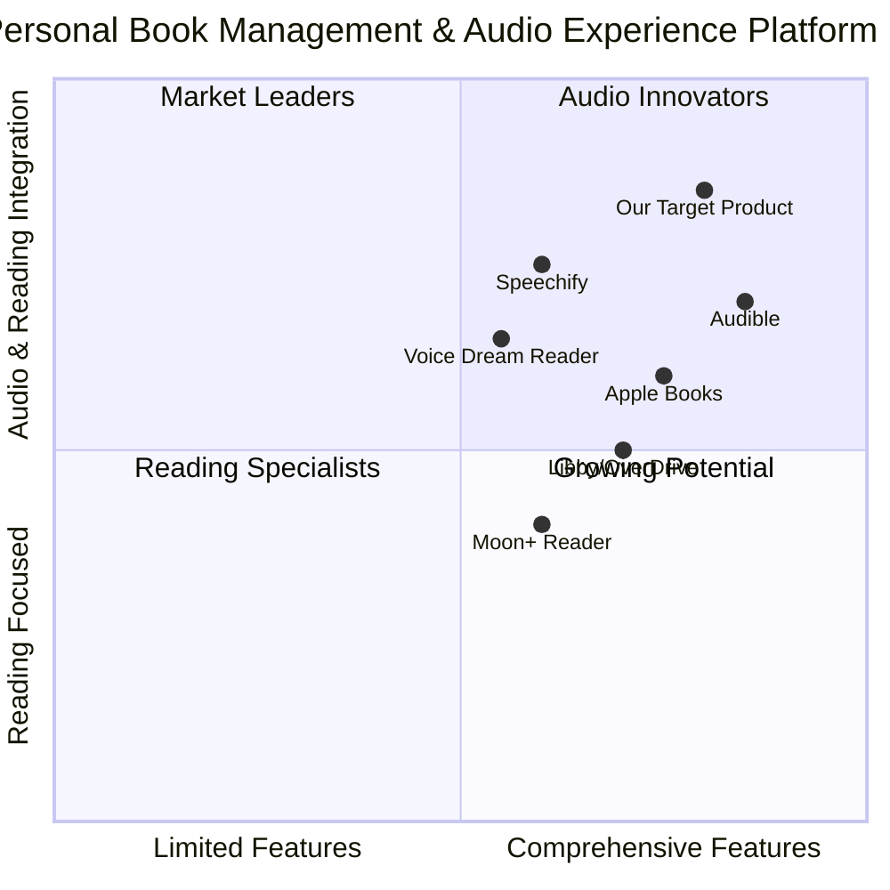

# Genesis Platform: Book Upload & Audio Transcription PRD

## Project Information
- **Project Name**: genesis_book_upload_audio
- **Date**: June 17, 2025
- **Author**: Emma, Product Manager
- **Version**: 1.0

## Original Requirements
Implement book upload and audio transcription features for the Genesis platform, enhancing the existing functionality to allow users to:  
1. Upload various book file formats (PDF, EPUB, etc.)  
2. Automatically generate audio narration from uploaded text  
3. Process and display both text and audio content in an integrated reading experience

## 1. Product Definition

### 1.1 Product Goals
1. **Enhanced Content Accessibility**: Enable users to access their book content in both text and audio formats, improving accessibility and providing flexibility in consumption methods
2. **Simplified Content Import**: Create a frictionless book upload experience that supports multiple file formats and automatically extracts and processes text content
3. **High-Quality Audio Experience**: Deliver natural-sounding audio narration that enhances the reading experience through advanced text-to-speech technology

### 1.2 User Stories

#### Content Upload
- As a user, I want to upload my eBook files (PDF, EPUB, MOBI, TXT) so that I can access and read them on the Genesis platform
- As a user, I want the platform to automatically extract text, structure, and metadata from my uploaded files so that they're properly organized in my library
- As a user, I want to be able to edit extracted metadata and add cover images if they're not automatically detected

#### Audio Generation
- As a user, I want to generate audio narration from my uploaded books so that I can listen to them while multitasking
- As a user, I want to select from different voice options for narration so that I can choose a voice that's pleasant to me
- As a user, I want to customize audio settings (speed, tone) to personalize my listening experience

#### Integrated Reading Experience
- As a user, I want to seamlessly switch between reading and listening modes so that I can consume content in my preferred way at any time
- As a user, I want the text to be synchronized with the audio playback so that I can follow along while listening
- As a user, I want to be able to download generated audio for offline listening

### 1.3 Competitive Analysis

| Product | Pros | Cons |
|---------|------|------|
| **Audible (Amazon)** | - High-quality professional narrations - Massive content library - Well-designed mobile apps | - Limited self-upload capabilities - Expensive subscription model - No integrated reading/listening experience |
| **Apple Books** | - Clean, intuitive interface - Good integration with Apple ecosystem - Both reading and audio functionality | - Limited customization - No user upload features - No text-to-speech generation |
| **Speechify** | - Strong text-to-speech technology - Supports multiple file formats - Cross-platform availability | - Subscription-based pricing - Limited document management - No social/community features |
| **Voice Dream Reader** | - Excellent accessibility features - Supports many file formats - Advanced TTS voices | - Dated interface - Separate purchase for premium voices - Limited social features |
| **Libby/OverDrive** | - Free library access - Both ebook and audiobook support - Good synchronization | - Limited to library content - No personal content upload - No TTS generation features |
| **Moon+ Reader** | - Highly customizable reading experience - Multiple format support - TTS integration | - Complex interface - Audio features are limited - Web functionality lacking |
| **Our Target Product** | - Integrated reading and listening in one platform - Self-upload of various formats - Automatic audio generation - Learning and community features | - New to market - Limited content library - AI voices vs professional narration |

### 1.4 Competitive Quadrant Chart

## 2. Technical Specifications

### 2.1 Architecture Overview

The implementation will build upon the existing Genesis platform architecture, adding new components and services to support book upload and audio transcription. The key architectural components include:

1. **File Upload & Processing Service**
   - Handles file uploads and queues them for processing
   - Extracts text, structure, and metadata from various file formats
   - Generates preview images and thumbnails

2. **Text-to-Speech Service**
   - Processes extracted text into audio segments
   - Manages audio generation queue and processing status
   - Provides voice selection and configuration options

3. **Content Storage & Delivery**
   - Stores processed text content, metadata, and generated audio files
   - Serves content with appropriate streaming capabilities for audio
   - Provides synchronization data between text and audio

4. **Enhanced User Interface Components**
   - Upload interface with progress indicators
   - Updated book viewer with integrated audio controls
   - Voice selection and audio settings interface

### 2.2 File Format Support

**Must Support:**
- PDF (.pdf)
- EPUB (.epub)
- Plain text (.txt)

**Should Support:**
- Kindle format (.mobi, .azw)
- Microsoft Word (.docx)
- Rich Text Format (.rtf)

**May Support:**
- HTML files (.html)
- Markdown files (.md)
- Comic book archives (.cbz, .cbr)

### 2.3 Audio Feature Requirements

**Must Have:**
- Text-to-speech conversion for uploaded documents
- Multiple voice options (minimum 5 voices)
- Basic playback controls (play, pause, skip, rewind)
- Text highlighting synchronized with audio playback
- Adjustable playback speed (0.5x to 2.0x)

**Should Have:**
- Voice customization options (pitch, emphasis)
- Background processing for large documents
- Progress saving across devices
- Offline listening capability
- Chapter/section navigation in audio mode

**May Have:**
- Voice emotion detection based on text content
- Multiple voices for dialogue in fiction (character detection)
- Audio mixing with background sounds/music
- Audio quality enhancement filters

## 3. Requirements Analysis

### 3.1 Current Limitations

The existing Genesis platform currently has limitations that need to be addressed:

1. **Limited File Handling**: The platform only supports basic file uploads without processing of content
2. **No Content Extraction**: Metadata and text must be manually entered rather than extracted from files
3. **Missing Audio Components**: The UI shows audio capability placeholders, but functionality isn't implemented
4. **Basic Progress Tracking**: Book progress is tracked but isn't synchronized between text and audio modes

### 3.2 Integration Points

The new features will integrate with existing components:

1. **BookContext**: Extend to handle audio-related properties and processing status
2. **LibraryPage**: Enhance upload modal to support file processing and audio generation options
3. **BookViewer**: Update to fully support audio playback and synchronization with text
4. **User Settings**: Add preferences for default voice and audio settings

### 3.3 Technical Dependencies

1. **File Processing Library**: Integration with a document parsing library (PyMuPDF or similar)
2. **Text-to-Speech API**: Integration with a TTS service (ElevenLabs, OpenAI TTS, or similar)
3. **Audio Processing**: Implementation of audio streaming and synchronization capabilities
4. **Storage**: Enhanced storage solution for audio files and processed documents

## 4. Requirements Pool

### 4.1 Book Upload & Processing (P0)

1. **File Upload Interface**
   - Drag-and-drop support for files
   - Multi-file upload capability
   - Upload progress indication
   - File type validation
   - File size limits and validation

2. **Document Processing**
   - Text extraction from various file formats
   - Structure detection (chapters, sections)
   - Metadata extraction (title, author, etc.)
   - Cover image extraction or generation
   - Processing status indication

3. **Content Management**
   - Storage of extracted text with structure preserved
   - Metadata editing capabilities
   - Content organization in user library
   - Thumbnail/preview generation

### 4.2 Audio Generation (P0)

1. **Text-to-Speech Processing**
   - Integration with TTS API service
   - Background processing for large documents
   - Chapter-by-chapter audio generation
   - Processing status tracking and display
   - Error handling for failed conversions

2. **Voice Configuration**
   - Voice selection interface
   - Custom voice settings (speed, pitch, etc.)
   - Voice preview functionality
   - Default voice preferences

3. **Audio Content Management**
   - Storage of generated audio files
   - Segmentation of audio by chapters/sections
   - Audio metadata and synchronization data
   - Audio file format optimization

### 4.3 Integrated Reading Experience (P1)

1. **Enhanced BookViewer**
   - Toggle between text and audio modes
   - Synchronized text highlighting during playback
   - Continuous reading/listening across sessions
   - Progress synchronization between modes

2. **Audio Playback Controls**
   - Play/pause functionality
   - Skip forward/backward controls
   - Speed adjustment controls
   - Volume controls
   - Chapter/section navigation

3. **Offline Capabilities**
   - Download audio for offline listening
   - Storage management for downloaded content
   - Sync progress when back online

### 4.4 Enhanced Features (P2)

1. **Advanced Voice Features**
   - Multiple voice support for dialogue
   - Emotion detection and voice adaptation
   - Custom voice upload or creation

2. **Analytics & Insights**
   - Reading vs. listening time analytics
   - Content consumption patterns
   - Voice preference analytics

3. **Accessibility Enhancements**
   - Screen reader compatibility
   - Additional accessibility controls
   - High-contrast mode support

## 5. UI Design Draft

### 5.1 File Upload Modal Enhancements

The existing upload modal will be enhanced to include:

- Progress indicators for both upload and processing phases
- Automatic metadata display with edit capabilities
- Voice selection dropdown with preview option
- Processing status indicators
- Generation options (full book vs. selected chapters)

### 5.2 BookViewer Audio Integration

The BookViewer component will be enhanced to include:

- Prominent audio player control bar
- Text synchronization highlighting
- Chapter navigation in audio mode
- Audio settings panel (voice, speed, etc.)
- Download audio option

### 5.3 Library View Enhancements

Library view will be updated to include:

- Audio availability indicators
- Processing status for books in queue
- Filter options for books with audio
- Audio generation options for existing books

## 6. API Requirements

### 6.1 Document Processing API

**Endpoints needed:**
- `POST /api/books/upload` - Upload book files
- `GET /api/books/{id}/processing-status` - Check processing status
- `GET /api/books/{id}/content` - Get processed text content
- `PUT /api/books/{id}/metadata` - Update book metadata

### 6.2 Audio Generation API

**Endpoints needed:**
- `POST /api/books/{id}/generate-audio` - Start audio generation
- `GET /api/books/{id}/audio/status` - Check audio generation status
- `GET /api/books/{id}/audio/{chapter}` - Stream audio content
- `GET /api/books/{id}/audio/download` - Download full audio
- `PUT /api/books/{id}/audio/settings` - Update voice settings

### 6.3 External API Integrations

**Text-to-Speech API Requirements:**
- Support for multiple voices and languages
- Natural-sounding speech capabilities
- Control over speed, pitch, and emphasis
- Batch processing capabilities
- Streaming audio output
- Cost-effective pricing model

## 7. Implementation Plan

### 7.1 Phase 1: Core Upload & Processing (Weeks 1-3)

1. Develop enhanced file upload component
2. Implement document processing service
3. Create metadata extraction and editing capabilities
4. Update BookContext to handle processed content
5. Enhance LibraryPage to display processing status

### 7.2 Phase 2: Audio Generation (Weeks 4-6)

1. Integrate with selected TTS API
2. Develop audio generation service
3. Implement voice selection and configuration
4. Create audio storage and management system
5. Add audio processing status to UI

### 7.3 Phase 3: Integrated Experience (Weeks 7-10)

1. Update BookViewer with audio playback capabilities
2. Implement text-audio synchronization
3. Develop audio controls and settings interface
4. Create offline functionality
5. Integrate progress tracking across modes

## 8. Open Questions

1. **API Selection**: Which text-to-speech API provides the best balance of quality, features, and cost?
2. **Storage Requirements**: How will we handle storage scaling for audio files, which are significantly larger than text?
3. **Processing Limits**: Should we set limits on document size or length for processing? If so, what are appropriate limits?
4. **Offline Strategy**: What's the best approach for enabling offline access while managing device storage constraints?
5. **Voice Personalization**: To what extent should users be able to customize voices beyond the provided options?
6. **Processing Queue**: How will we prioritize processing jobs when multiple users request audio generation?

## 9. Success Metrics

1. **User Adoption**: Percentage of users who upload books and generate audio
2. **Processing Success Rate**: Percentage of successful text extraction and audio generation
3. **Mode Usage**: Distribution between reading and listening modes
4. **Time Savings**: Reduction in manual metadata entry time
5. **Engagement**: Average listening time and completion rates for audio content
6. **User Satisfaction**: Ratings specific to upload experience and audio quality

## 10. Accessibility Considerations

1. All new features must be keyboard accessible
2. Audio controls must include proper ARIA roles and labels
3. Text-to-speech features should complement, not replace, screen reader compatibility
4. Processing status updates must be announced to screen readers
5. Color indicators must have text alternatives for color-blind users

## 11. Market Analysis & Opportunities

### 11.1 Audiobook Market Overview

The global audiobook market is experiencing significant growth, with an estimated value of $7.21-8.97 billion in 2025 and projected to reach $17.18-35.47 billion by 2030, growing at a CAGR of 15.57-26.4%. This growth is driven by:

- Increased smartphone penetration (54% of the global population)
- Changing consumer preferences toward on-the-go content consumption
- Technological advancements in AI-powered text-to-speech solutions
- Growing demand for multitasking-compatible content consumption

### 11.2 Target Audience Analysis

- **Primary Audience**: Adults (76.4% of the market)
- **Usage Pattern**: 50% of listeners consume audiobooks 1-4 hours per week
- **Gender Distribution**: Slight male predominance (55.57%)
- **Quality Expectations**: 59% of listeners have abandoned audiobooks due to poor narration quality

### 11.3 Market Differentiation Strategy

Genesis will differentiate by:

1. **Self-Service Model**: Unlike competitors who rely on professional narrators or limited content libraries, Genesis empowers users to convert any text content they own into audiobooks
2. **Integrated Experience**: Seamless transition between reading and listening modes with synchronized progress
3. **AI-Powered Quality**: Leveraging state-of-the-art TTS technology to provide narration quality that approaches human-level
4. **Learning Integration**: Unique integration with learning tools (flashcards, quizzes) unavailable in pure audiobook platforms

## 12. Book-to-Audio Conversion Process

### 12.1 End-to-End Conversion Workflow

1. **File Upload**: User uploads supported document format (PDF, EPUB, MOBI, etc.)
2. **Text Extraction**: System processes the document to extract plain text while preserving structure
   - PDF processing: Extract text while maintaining chapter/section division
   - EPUB processing: Parse HTML content and extract text with formatting cues
   - Other formats: Convert to intermediate format before text extraction if needed
3. **Content Structuring**: Analyze extracted text to identify:
   - Chapters and sections
   - Paragraphs and sentences
   - Special content (quotes, footnotes, references)
4. **Text Preprocessing**: 
   - Clean text (remove artifacts, fix encoding issues)
   - Format numbers, abbreviations, and special characters for proper pronunciation
   - Identify potential pronunciation challenges
5. **Audio Generation**: Process text through selected TTS engine
   - Generate audio in chapter-sized chunks
   - Create synchronization markers for text highlighting
   - Apply selected voice and audio settings
6. **Post-processing**: 
   - Normalize audio levels
   - Add appropriate pauses between sections
   - Apply audio enhancements if configured
7. **Finalization**: 
   - Package audio files with metadata
   - Create chapter navigation markers
   - Link audio segments with corresponding text positions

### 12.2 File Format-Specific Processing

| Format | Processing Approach | Challenges | Solution |
|--------|---------------------|------------|----------|
| **PDF** | PyMuPDF extraction with layout analysis | Complex layouts, multi-column text, tables, images | Layout detection algorithm with reading order optimization |
| **EPUB** | HTML parsing with content extraction | Variable HTML structure between publishers | Standardized parsing with publisher-specific adaptations |
| **MOBI/AZW** | Conversion to EPUB then processing | DRM protection, proprietary format | Integration with DRM-aware processing libraries |
| **TXT/RTF** | Direct text processing | Limited structure information | Structure detection based on spacing and formatting |
| **DOCX** | XML parsing with structure preservation | Complex formatting, embedded objects | MSOffice document parser with text flow analysis |

### 12.3 Text-to-Speech Engine Requirements

**Our TTS engine selection must prioritize:**

1. **Quality**: Natural-sounding voices with proper intonation and emotion
2. **Long-form Processing**: Ability to maintain consistent voice characteristics across long documents
3. **Customization**: Support for adjusting voice characteristics (speed, pitch, emphasis)
4. **Performance**: Efficient processing of large text volumes
5. **Cost-effectiveness**: Reasonable pricing for high-volume audio generation

**Technical capabilities required:**

- SSML (Speech Synthesis Markup Language) support
- Multiple high-quality voices across genders and accents
- Natural-sounding pauses and breathing patterns
- Emotion detection and adaptation based on context
- Support for both streaming and batch processing

### 12.4 Audio Processing Specifications

**Audio Quality Standards:**

- Format: MP3 (primary), optional WAV for highest quality
- Bit rate: 128kbps (standard), 192kbps (high quality)
- Sample rate: 44.1kHz
- Channels: Mono for voice content, stereo for enhanced audio

**Audio Segmentation:**

- Primary segmentation by chapter
- Secondary segmentation for segments over 20 minutes
- Include proper metadata for each segment
- Store timestamp mapping between audio position and text position

**Audio Enhancement:**

- Normalize volume levels across chapters
- Apply subtle compression for voice clarity
- Add appropriate silence between sections
- Optional background ambience for enhanced listening experience

## 13. Storage & Performance Considerations

### 13.1 Storage Requirements Analysis

Audio files require significantly more storage than their text counterparts. Based on our analysis:

- Average book length: 80,000 words
- Average speaking rate: 150-160 words per minute
- Average audiobook length: ~8-10 hours
- MP3 file size at 128kbps: ~60-75MB per book

**Storage Projections:**

| User Type | Books Processed | Storage Required |
|-----------|-----------------|------------------|
| Light     | 5 books         | ~300-375MB       |
| Average   | 20 books        | ~1.2-1.5GB       |
| Heavy     | 100+ books      | ~6-7.5GB+        |

### 13.2 Processing Resource Requirements

**Server-side processing estimates:**

- Text extraction: ~30 seconds per book (varies by format and complexity)
- TTS processing: ~5-10x realtime (8-10 hour book = 40-100 hours processing)

**Resource allocation strategy:**

- Queue-based processing with priority levels
- Parallelization of processing across chapters
- Batch processing during off-peak hours
- Processing time limits based on user tier

### 13.3 Performance Optimization Strategies

1. **Processing Optimization:**
   - Chapter-level parallel processing
   - Caching of intermediate processing results
   - Progressive delivery of processed chapters

2. **Storage Optimization:**
   - Compression of audio files
   - On-demand generation with caching
   - Tiered storage (hot/cold storage based on usage)

3. **Delivery Optimization:**
   - CDN integration for audio delivery
   - Adaptive streaming based on connection speed
   - Progressive loading of audio content

## 14. User Experience Flow

### 14.1 Book Upload & Processing Flow

1. User selects "Add New Book" in Library view
2. Upload modal appears with drag-drop area and file browser
3. User selects or drops file(s)
4. System validates file format and size
5. Upload progress indicator displays
6. After upload completes:
   - Preview of extracted metadata (title, author, etc.) is shown
   - Automatic cover image is displayed (if available)
   - Audio generation options are presented
7. User can edit metadata and configure audio options:
   - Select voice
   - Adjust speed/tone settings
   - Choose processing priority
8. User confirms settings and submits
9. Book appears in library with "Processing" status
10. User receives notification when processing completes

### 14.2 Audio Generation Options

Users will have the following options for audio generation:

- **Voice Selection**: Choose from multiple voice options (minimum 5 voices)
- **Processing Priority**: Standard or Expedited (based on user tier)
- **Quality Settings**: Standard (128kbps) or High (192kbps)
- **Advanced Options**:
  - Reading speed adjustment
  - Emphasis level customization
  - Pause length between paragraphs/chapters
  - Background ambient sound (optional)

### 14.3 Reading/Listening Experience Flow

1. User selects book from library
2. Book opens in reading mode by default
3. Audio player control bar appears if audio is available
4. User can:
   - Toggle between reading and listening modes
   - Adjust audio playback settings
   - Synchronize current position between modes
   - Add notes/highlights while listening
   - Download audio for offline use

## 15. Implementation Specifics

### 15.1 Frontend Components Updates

1. **Enhanced Upload Modal Component**
   - File drop zone with preview
   - Processing status indicators
   - Metadata editor
   - Voice selection interface
   - Audio settings configuration

2. **Audio Player Component**
   - Playback controls (play/pause, skip, speed)
   - Chapter navigation
   - Position synchronization with text
   - Audio settings controls

3. **Library View Enhancements**
   - Audio availability indicators
   - Processing status badges
   - Audio generation action buttons
   - Filter options for audio-enabled books

### 15.2 Backend Services Implementation

1. **DocumentProcessingService**
   - File validation and virus scanning
   - Format-specific text extraction
   - Structure and metadata detection
   - Content formatting and cleaning

2. **AudioGenerationService**
   - Text-to-speech processing queue
   - Voice profile management
   - Audio file management
   - Synchronization data generation

3. **ContentDeliveryService**
   - Streaming audio delivery
   - Progressive content loading
   - Offline content packaging
   - Performance optimization

### 15.3 Integration with Existing Features

1. **Learning Tools Integration**
   - Audio support in quiz generation
   - Flashcard support for vocabulary with audio
   - Mind map integration with audio content

2. **Community Features**
   - Audio clip sharing in discussions
   - Book club audio features
   - Expert Q&A about audio content

## 16. Future Expansion Opportunities

1. **Custom Voice Creation**: Allow users to train or customize voices for their content
2. **Multiple Language Support**: Expand TTS capabilities to cover various languages
3. **Voice-to-Text Transcription**: Enable users to record narration and generate text
4. **Enhanced Audio Features**: Background music, sound effects, multi-voice narration
5. **Audio Sharing Platform**: Community for sharing generated audiobooks (for public domain content)

---

## Appendix A: Technical API Selection Analysis

### Text-to-Speech API Comparison

| API Provider | Quality | Voice Options | Processing Speed | Cost | Integration Complexity |
|--------------|---------|---------------|-----------------|------|------------------------|
| ElevenLabs   | ★★★★★  | 25+ voices    | 5-10x realtime  | $$$  | Medium                |
| OpenAI TTS   | ★★★★☆  | 6 voices      | 3-7x realtime   | $$$  | Low                   |
| Google Cloud | ★★★★☆  | 220+ voices   | 1-3x realtime   | $$   | Medium                |
| Azure        | ★★★★☆  | 400+ voices   | 1-3x realtime   | $$   | Medium                |
| AWS Polly    | ★★★☆☆  | 60+ voices    | 1-2x realtime   | $    | Low                   |

### Document Processing API Comparison

| Library/API     | PDF Support | EPUB Support | MOBI Support | Processing Speed | Accuracy | Integration Complexity |
|-----------------|------------|-------------|-------------|-----------------|----------|------------------------|
| PyMuPDF         | ★★★★★      | ★★☆☆☆      | ★☆☆☆☆      | Very Fast       | ★★★★☆   | Medium                |
| Unstructured    | ★★★★☆      | ★★★★☆      | ★★★☆☆      | Fast            | ★★★★☆   | Low                   |
| PaddleOCR       | ★★★★☆      | ★★☆☆☆      | ★☆☆☆☆      | Medium          | ★★★★★   | High                  |
| Eden AI         | ★★★★☆      | ★★★☆☆      | ★★☆☆☆      | Fast            | ★★★★☆   | Low                   |
| Custom Solution | ★★★★★      | ★★★★★      | ★★★★★      | Varies          | ★★★★★   | High                  |
